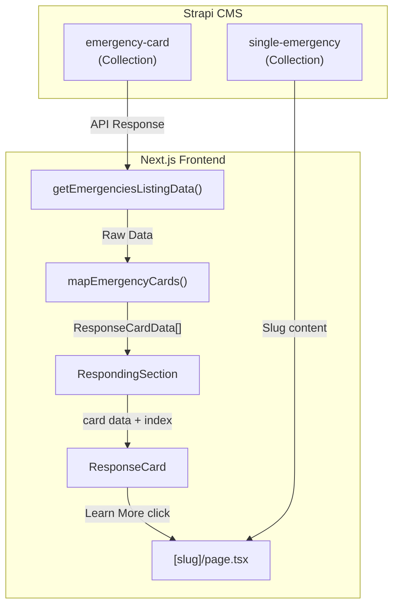

# Emergencies Page Structure Documentation

This document provides a comprehensive overview of the **Emergencies Listing Page** and **Single Emergency (Slug) Page**, including all components, data types, mock data, and the proposed Strapi schema structure.

---

## 📁 Folder Structure

```
src/app/[locale]/(pages)/emergencies/
├── page.tsx              → Emergencies Listing Page
└── [slug]/
    └── page.tsx          → Single Emergency Page (Dynamic)
```

---

## 1. Emergencies Listing Page

**File:** [page.tsx](<file:///Users/tahaali/Documents/GitHub/WEBSITE/frontend/src/app/[locale]/(pages)/emergencies/page.tsx>)

### Page Sections & Components

| Section            | Component                 | Data Source                                 | Notes                       |
| ------------------ | ------------------------- | ------------------------------------------- | --------------------------- |
| Hero               | `HeroSection`             | `heroCarouselData`, `heroStatsData` (local) | Red theme variant           |
| Crisis Spotlight   | `RespondingSection`       | `respondingData` (mock)                     | ⚠️ **Dynamic from backend** |
| How We Work        | `ResponseTimelineSection` | `reliefPhasesData` (mock)                   | Timeline cards              |
| Lives Supported    | Custom section + Buttons  | Static content                              | Green surface background    |
| Impact Stats       | `ImpactData`              | `impactData1` (mock)                        | Green theme                 |
| Choose Your Impact | `Linkcard` grid           | `linkcardData` (mock)                       | 4 cards                     |
| Latest News        | `LatestNewsCard` grid     | `latestNewsCardData` (mock)                 | Takes items 2-5             |
| Social Media       | `SocialMediaSection`      | Static or dynamic                           | From homepage mapper        |
| FAQ                | `FaqSection`              | No props, uses default                      | Collapsible FAQ             |

---

## 2. Single Emergency Page (Slug)

**File:** [page.tsx](<file:///Users/tahaali/Documents/GitHub/WEBSITE/frontend/src/app/[locale]/(pages)/emergencies/[slug]/page.tsx>)

### Page Sections & Components

| Section               | Component             | Data Source                                 | Notes             |
| --------------------- | --------------------- | ------------------------------------------- | ----------------- |
| Hero                  | `HeroSection`         | `heroCarouselData`, `heroStatsData` (local) | Red theme         |
| Situation Overview    | Custom section        | `reliefPhasesDatav2` (local)                | Stats with icons  |
| Image Grid            | `Image` grid          | Static images                               | 2x3 masonry-like  |
| Islamic Relief Impact | `ImpactData`          | `impactData2` (local)                       | Yellow background |
| Priority Projects     | `ProjectCard` grid    | `projectsCard` (local)                      | 2 cards           |
| Impact Stats          | `ImpactData`          | `impactData1` (mock)                        | Green theme       |
| Latest News           | `LatestNewsCard` grid | `latestNewsCardData` (mock)                 | 3 cards           |
| Social Media          | `SocialMediaSection`  | Static                                      | Same as listing   |
| FAQ                   | `FaqSection`          | No props                                    | Default FAQ       |

---

## 3. RespondingSection – Key Dynamic Component

> [!IMPORTANT]
> This section is the **main focus** for Strapi integration. The cards displayed here should be dynamic, coming from the backend and linking to individual emergency pages.

### Component Files

| File                                                                                                                     | Purpose                                                  |
| ------------------------------------------------------------------------------------------------------------------------ | -------------------------------------------------------- |
| [RespondingSection.tsx](file:///Users/tahaali/Documents/GitHub/WEBSITE/frontend/src/components/ui/RespondingSection.tsx) | Container that renders `ResponseCard` for each emergency |
| [ResponseCard.tsx](file:///Users/tahaali/Documents/GitHub/WEBSITE/frontend/src/components/ui/ResponseCard.tsx)           | Individual card with image, title, description, buttons  |
| [responseCardData.ts](file:///Users/tahaali/Documents/GitHub/WEBSITE/frontend/src/data/responseCardData.ts)              | Mock data (5 emergencies)                                |
| [responseCard.ts](file:///Users/tahaali/Documents/GitHub/WEBSITE/frontend/src/types/responseCard.ts)                     | Type definition                                          |

### RespondingSection Component

```tsx
const RespondingSection = ({ cards }: { cards: ResponseCardData[] }) => {
  return (
    <div className="flex flex-col gap-12">
      {cards.map((card, index) => (
        <ResponseCard
          key={index}
          data={card}
          reverse={index % 2 === 1} // Alternating layout
        />
      ))}
    </div>
  );
};
```

### ResponseCardData Type

```typescript
// File: src/types/responseCard.ts

export interface ResponseCardData {
  image: string; // Image URL (from Strapi media)
  alt: string; // Alt text for accessibility
  title: string; // Emergency title (e.g., "Emergency Gaza")
  description: string; // Summary text
  buttons: {
    label: string; // Button text (e.g., "DONATE NOW")
    link: string; // URL (e.g., "/donate" or "/emergencies/gaza")
    bgColor: string; // "yellow" or "white"
  }[];
}
```

### Current Mock Data Structure

```typescript
// File: src/data/responseCardData.ts

export const respondingData: ResponseCardData[] = [
  {
    image: "/Images/ResponseCard-1.png",
    alt: "Disaster Relief",
    title: "Emergency Gaza",
    description: "2024 Restera...",
    buttons: [
      { label: "DONATE NOW", link: "/donate", bgColor: "yellow" },
      { label: "LEARN MORE", link: "/emergencies/Gaza", bgColor: "white" },
    ],
  },
  // ... Gaza, Sudan, Yemen, Syria, Famine
];
```

> [!NOTE]
> The "LEARN MORE" button links to `/emergencies/{slug}` which routes to the dynamic slug page.

---

## 4. All Data Types Reference

### CarouselData (Hero Images)

```typescript
// File: src/types/carousel.types.ts

interface CarouselItem {
  id: string;
  url: string; // Image URL
  alt: string;
  title: string;
  subtitle: string;
  buttonText: string;
  buttonLink: string;
}

interface CarouselData {
  carouselItems: CarouselItem[];
}
```

### ImpactStatsData (Hero Stats)

```typescript
// File: src/types/impactStats.ts

interface ImpactStat {
  id: number;
  value: string; // e.g., "94%", "2.4M+"
  label: string;
  type: string; // "percentage" | "count"
}

interface ImpactStatsData {
  impactStats: ImpactStat[];
}
```

### ImpactData (ImpactData Component)

```typescript
// File: src/types/impactData.ts

interface ImpactStat {
  id: number;
  icon: string; // Icon URL
  value: string | null; // Optional value
  label: string;
  description: string;
}

interface ImpactData {
  stats: ImpactStat[];
}
```

### ResponseCardData (Timeline - How We Work)

```typescript
// File: src/components/ui/ResponseTimelineCard.tsx

interface ResponseCardData {
  id: string;
  theme: "red" | "blue" | "green";
  icon: string;
  label: string; // e.g., "First 72 hours"
  title: string; // e.g., "EMERGENCY RESPONSE"
  description: string;
  items: string[]; // Checklist items
}
```

### LatestNewsCardData

```typescript
// File: src/types/latestNewsCard.ts

interface LatestNewsCardData {
  id: number;
  image: string;
  title: string;
  read: string; // e.g., "3 MIN READ"
  date: string; // e.g., "DECEMBER 13, 2023"
  categories: string[];
  link: string;
}
```

### LinkCardData

```typescript
// File: src/types/linkCards.ts

interface LinkCardData {
  id: number;
  icon: string;
  title: string;
  description: string;
  link: string;
  linkText: string;
}
```

---

## 5. Current Strapi Data Fetching

**File:** [getEmergenciesListingData.ts](file:///Users/tahaali/Documents/GitHub/WEBSITE/frontend/src/lib/pages/emergencies-listing/getEmergenciesListingData.ts)

### Current Populate Structure

```typescript
const EMERGENCIES_LISTING_POPULATE = {
  heroSection: {
    populate: {
      sectionHeading: "*",
      images: { populate: "*" },
      stats: { populate: "*" },
    },
  },
  esembleCardSection: { ... },     // Crisis Spotlight (RespondingSection)
  howWeWorkSection: { ... },       // Timeline cards
  callToAction: { populate: "*" },
  impactData: { populate: "*" },
  sectionHeading: { populate: "*" },
  makeImpactCard: { populate: "*" },
  newsCard: { ... },
  socialMediaSection: { ... },
  faqs: { populate: "*" },
};
```

> [!WARNING]
> The data is fetched but **not connected** to the UI. The page still uses mock data.

---

## 6. Proposed Strapi Schema for RespondingSection

### Collection Type: `emergency-card`

This should be a **collection type** (not a component) since each card represents a separate emergency that links to its own page.

| Field             | Type             | Description                      |
| ----------------- | ---------------- | -------------------------------- |
| `title`           | Text             | Emergency title                  |
| `slug`            | UID (from title) | URL slug for /emergencies/{slug} |
| `description`     | Rich Text        | Summary text                     |
| `image`           | Media (Single)   | Card image                       |
| `alt`             | Text             | Image alt text                   |
| `donateButton`    | Component        | { label, link, bgColor }         |
| `learnMoreButton` | Component        | { label, link, bgColor }         |
| `isActive`        | Boolean          | Show/hide on listing             |
| `order`           | Number           | Display order                    |

### Component: `button-link`

| Field     | Type | Options                        |
| --------- | ---- | ------------------------------ |
| `label`   | Text | Button text                    |
| `link`    | Text | URL path                       |
| `bgColor` | Enum | ["yellow", "white", "primary"] |

### Relation to Single Emergency

Each `emergency-card` should have a **relation** to a `single-emergency` content type (or use the slug for routing):

```
emergency-card.slug → routes to → /emergencies/[slug]
```

---

## 7. Integration Steps

### Step 1: Create Strapi Schema

1. Create `emergency-card` collection type
2. Create `button-link` component
3. Add fields as specified above

### Step 2: Update Data Fetcher

```typescript
// In getEmergenciesListingData.ts - add:
crisisSpotlight: {
  populate: {
    sectionHeading: "*",
    emergencyCards: {
      populate: {
        image: "*",
        donateButton: "*",
        learnMoreButton: "*",
      },
      sort: ["order:asc"],
      filters: { isActive: { $eq: true } },
    },
  },
},
```

### Step 3: Create Mapper

```typescript
// File: src/lib/mappers/emergencies.ts

export function mapEmergencyCards(data: any): ResponseCardData[] {
  return data.emergencyCards.map((card: any) => ({
    image: card.image?.url || "/placeholder.png",
    alt: card.alt || card.title,
    title: card.title,
    description: card.description,
    buttons: [
      {
        label: card.donateButton?.label || "DONATE NOW",
        link: card.donateButton?.link || "/donate",
        bgColor: card.donateButton?.bgColor || "yellow",
      },
      {
        label: card.learnMoreButton?.label || "LEARN MORE",
        link: `/emergencies/${card.slug}`,
        bgColor: card.learnMoreButton?.bgColor || "white",
      },
    ],
  }));
}
```

### Step 4: Update Page

```tsx
// In emergencies/page.tsx

const emergenciesData = await getEmergenciesListingData(locale);
const emergencyCards = emergenciesData
  ? mapEmergencyCards(emergenciesData.crisisSpotlight)
  : respondingData; // Fallback to mock

<RespondingSection cards={emergencyCards} />;
```

---

## 8. Data Flow Diagram



---

## 9. File Reference Quick Links

### Pages

- [Listing Page](<file:///Users/tahaali/Documents/GitHub/WEBSITE/frontend/src/app/[locale]/(pages)/emergencies/page.tsx>)
- [Slug Page](<file:///Users/tahaali/Documents/GitHub/WEBSITE/frontend/src/app/[locale]/(pages)/emergencies/[slug]/page.tsx>)

### Components

- [RespondingSection](file:///Users/tahaali/Documents/GitHub/WEBSITE/frontend/src/components/ui/RespondingSection.tsx)
- [ResponseCard](file:///Users/tahaali/Documents/GitHub/WEBSITE/frontend/src/components/ui/ResponseCard.tsx)
- [ResponseTimelineSection](file:///Users/tahaali/Documents/GitHub/WEBSITE/frontend/src/components/ui/ResponseTimelineSection.tsx)
- [ResponseTimelineCard](file:///Users/tahaali/Documents/GitHub/WEBSITE/frontend/src/components/ui/ResponseTimelineCard.tsx)

### Types

- [responseCard.ts](file:///Users/tahaali/Documents/GitHub/WEBSITE/frontend/src/types/responseCard.ts)
- [carousel.types.ts](file:///Users/tahaali/Documents/GitHub/WEBSITE/frontend/src/types/carousel.types.ts)
- [impactStats.ts](file:///Users/tahaali/Documents/GitHub/WEBSITE/frontend/src/types/impactStats.ts)
- [impactData.ts](file:///Users/tahaali/Documents/GitHub/WEBSITE/frontend/src/types/impactData.ts)
- [latestNewsCard.ts](file:///Users/tahaali/Documents/GitHub/WEBSITE/frontend/src/types/latestNewsCard.ts)
- [linkCards.ts](file:///Users/tahaali/Documents/GitHub/WEBSITE/frontend/src/types/linkCards.ts)

### Mock Data

- [responseCardData.ts](file:///Users/tahaali/Documents/GitHub/WEBSITE/frontend/src/data/responseCardData.ts)
- [reliefData.ts](file:///Users/tahaali/Documents/GitHub/WEBSITE/frontend/src/data/reliefData.ts)
- [impactData.ts](file:///Users/tahaali/Documents/GitHub/WEBSITE/frontend/src/data/impactData.ts)

### Data Fetcher

- [getEmergenciesListingData.ts](file:///Users/tahaali/Documents/GitHub/WEBSITE/frontend/src/lib/pages/emergencies-listing/getEmergenciesListingData.ts)
